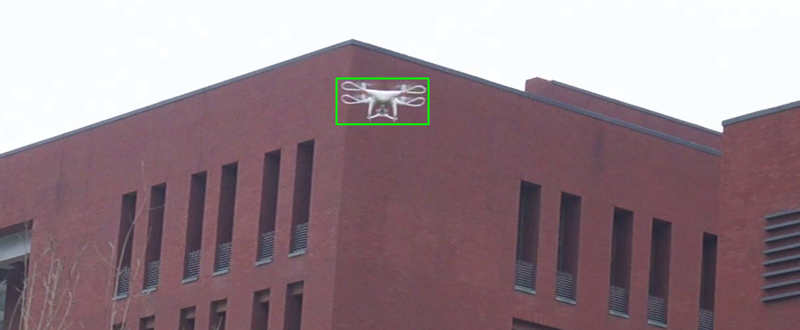

# **Fusion-Based Object Tracking and Detection**

This repository contains the implementation of a fusion-based object tracking and detection system. The system combines traditional object tracking methods with advanced object detection models to enhance the accuracy and robustness of tracking objects in video streams.


## **Introduction**
Object tracking is a critical task in computer vision, with applications in surveillance, robotics, autonomous driving, and more. This project aims to improve object tracking performance by fusing object detection models with traditional tracking algorithms. The project supports three state-of-the-art detectors: YOLOX, Faster R-CNN, and Cascade R-CNN, and allows the user to switch between these models seamlessly.

The system works in two modes:
1. **Tracker-Only Mode:** Utilizes traditional object trackers like CSRT or KCF to track objects based on initial bounding box initialization.
2. **Fusion Mode:** Combines the object detection results from a deep learning model with the traditional tracker to enhance the tracking performance, especially in challenging scenarios like occlusions or object appearance changes.

## **Features**
- Support for multiple object tracking algorithms (CSRT, KCF, etc.).
- Integration with state-of-the-art object detectors: YOLOX, Faster R-CNN, and Cascade R-CNN.
- Automatic reinitialization of the tracker using detection results when tracking fails.
- Computation of Intersection over Union (IoU) and center location error for performance evaluation.
- Real-time video processing with options to save the output videos.

## **Requirements**
- Python 3.8 or higher
- PyTorch 1.10 or higher
- OpenCV 4.5 or higher
- MMDetection framework

## **Installation**
To set up the environment for this project, follow these steps:

1. Clone this repository:
    ```bash
    git clone https://github.com/yourusername/Fusion-Based-Object-Tracking.git
    cd Fusion-Based-Object-Tracking
    ```

2. Create a virtual environment and activate it:
    ```bash
    python -m venv venv
    source venv/bin/activate  # On Windows, use `venv\Scripts\activate`
    ```

3. Install the required packages:
    ```bash
    pip install -r requirements.txt
    ```

4. Install the MMDetection framework:
    ```bash
    git clone https://github.com/open-mmlab/mmdetection.git
    cd mmdetection
    pip install -e .
    ```

5. Download the pre-trained models and place them in the `checkpoints` directory:
    - [YOLOX](https://drive.google.com/drive/folders/1WNy8sA4AzsmmTUuArbJmyPmTVW_pPYRm?usp=sharing)
    - [Faster R-CNN](https://drive.google.com/drive/folders/1WNy8sA4AzsmmTUuArbJmyPmTVW_pPYRm?usp=sharing)
    - [Cascade R-CNN](https://drive.google.com/drive/folders/1WNy8sA4AzsmmTUuArbJmyPmTVW_pPYRm?usp=sharing)


## **Usage**
To run the tracker-only mode or the fusion mode, use the following command:

```bash
python main.py --video path/source/video11.mp4 --annotations path/source/video11_gt.txt --tracker csrt --detector yolox
```

<br>

## **Object Tracking and Detection Results**

### **Object Tracking Only**
Below is the result when only the object tracking algorithm is applied:


<br>

<div align="center">

**CSRT Algorithm** 
  
  
  
  <br><br>

**Median Flow Algorithm** 
  
  
  
  <br><br>

**KCF Algorithm** 
  
  

  <br><br>

**CSRT Algorithm (Alternate Example)** 
  
  

</div>

  <br><br>

### **Fusion of Object Tracking and Detection**
<br>

<div align="center">

**CSRT + Faster R-CNN** 
  
  
  
  <br><br>

**KCF + YOLOX** 
  
  
  
  <br><br>

**Median Flow + Cascade R-CNN** 
  
  
  
  <br><br>

**CSRT + Faster R-CNN (Alternate Example)** 

  

</div>


As demonstrated, the fusion model significantly improves the accuracy of object tracking by incorporating detection data, leading to more robust performance in challenging scenarios.


The results of the tracking system are evaluated based on:

- Mean IoU: The average Intersection over Union between ground truth and predicted bounding boxes.
- Average Center Position Error: The average distance between the center of the ground truth and predicted bounding boxes.
- Successful Frame Rate: The proportion of frames where the IoU is greater than zero.
These metrics provide insights into the tracker's and the fusion system's performance.


<br>


**Object Tracking Algorithms**

- CSRT
- KCF
- MOSSE
- MedianFlow
- TLD
- MIL
- Boosting


**Object Detection Models**

- YOLOX
- Faster R-CNN
- Cascade R-CNN

<br>


> **Important Note:**  
> Upon executing the code, the system will initially process the video using only the object tracking algorithm, with its performance evaluated through the appropriate performance metrics. Subsequently, the system will apply the Fusion Algorithm, which integrates the Object Tracking Algorithm with the Object Detection Model. The same performance metrics will be used to assess the performance of this combined approach. The results of these evaluations will be displayed on the screen as output.

<br>

## **Resources**

### **Dataset**
The dataset used for this project can be found at the following link:
[DUT Anti-UAV Dataset](https://github.com/wangdongdut/DUT-Anti-UAV)

### **MMDetection Library**
For the object detection component of this project, we utilized the MMDetection library. You can find more details and installation instructions at the official repository:
[MMDetection GitHub Repository](https://github.com/open-mmlab/mmdetection)


### **Model Weights and Test Videos**

Due to the large size of the model weights and test videos, they have not been uploaded to the GitHub repository. You can download them from the following Google Drive link:

[Download Model Weights and Test Videos](https://drive.google.com/drive/folders/1WNy8sA4AzsmmTUuArbJmyPmTVW_pPYRm?usp=sharing)

Please ensure that you have these files in the appropriate directories before running the code.


